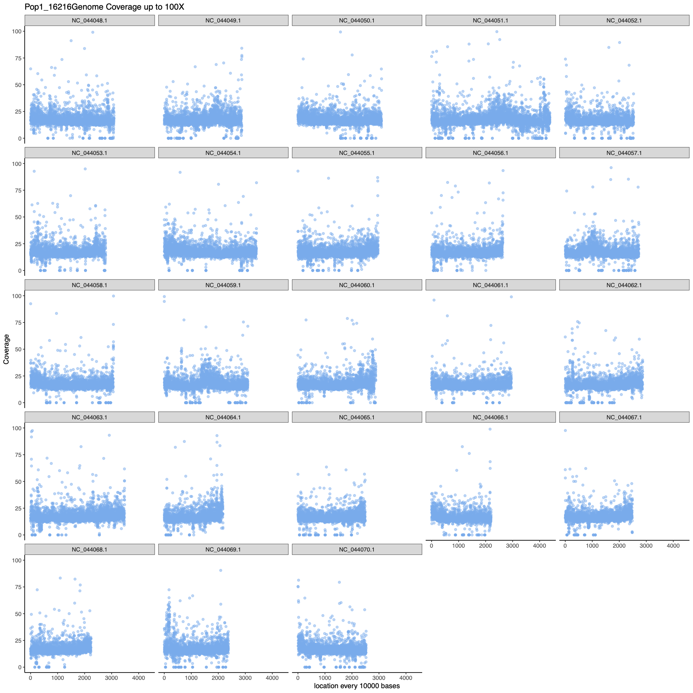
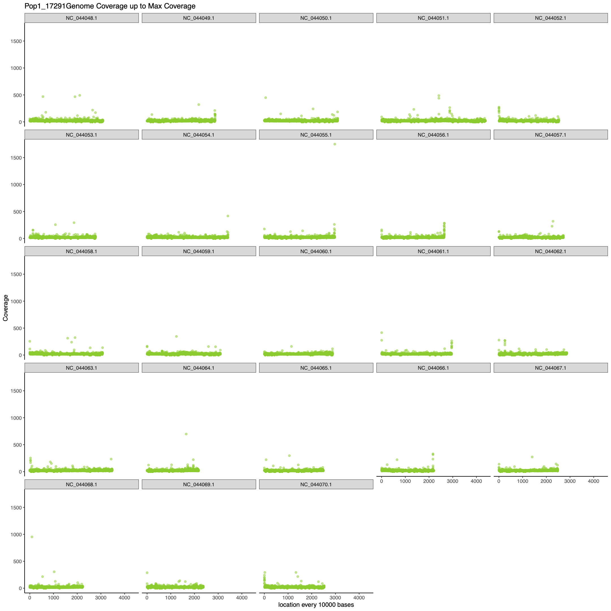
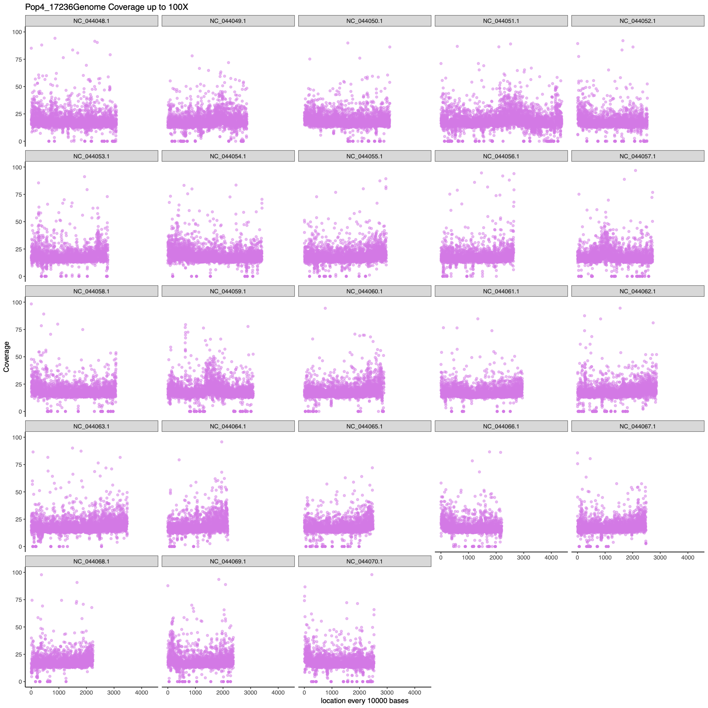
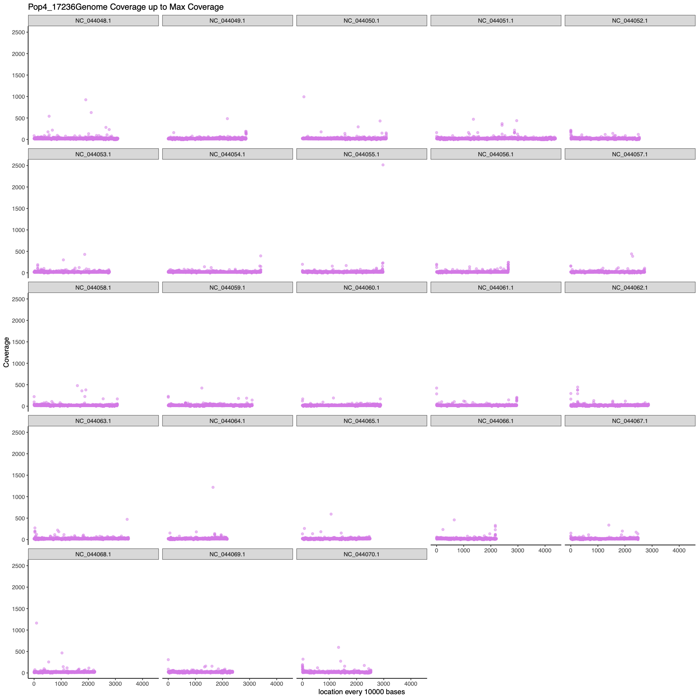
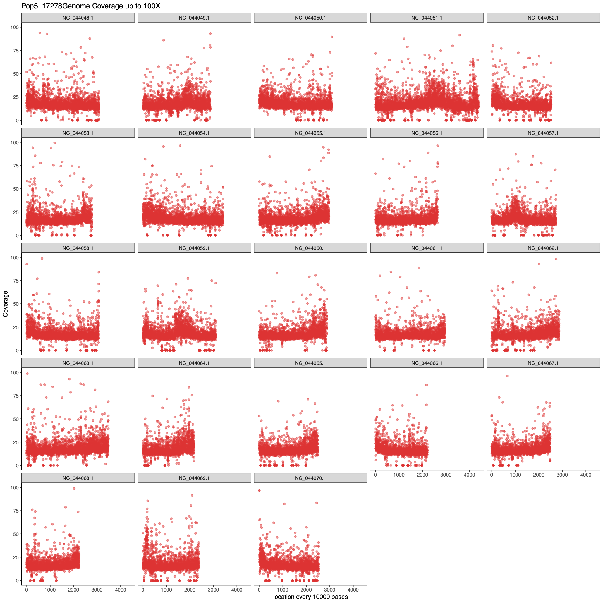
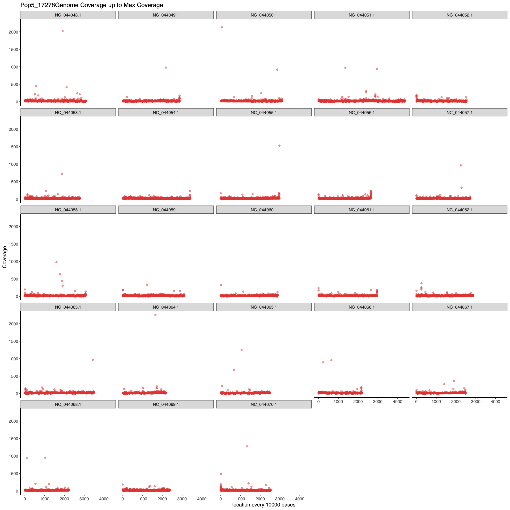
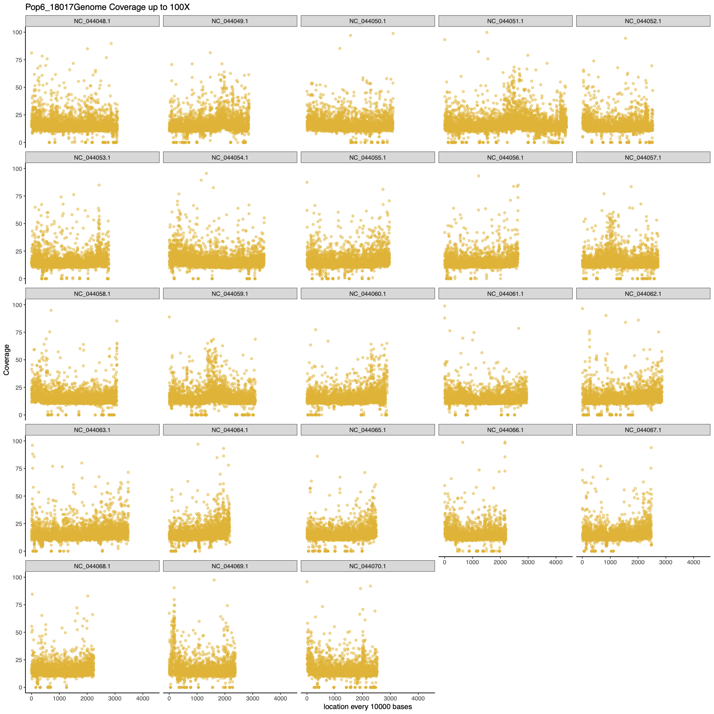

# Using Bedtools to determine genome coverage

To calculate coverage you need your genomic elements file that have the chromosome information for your species. For the cod genome I had to subset the .gff file to just get "region" elements which are the chromosomes (Super_Scaffolds) and contigs. See this file describing these genomic elements from the cod genome: http://www.magic.re.kr/publicdb/Gadus%20morhua/GCF_902167405.1_gadMor3.0_assembly_report.txt and see R script scripts/subsetCodGFFfile.R for how I subset the original gff file.

You do not need to convert your bam file to bed. Bedtools current version is set up to take Bam files. 

## BEDTOOLS COVERAGE (RESULTS DON'T MAKE SENSE): 
Example run for coverage calculator: 
```
	module load lotterhos/2020-08-24
	source activate lotterhos-py38
	bedtools coverage -a Cod_genome_data/GCF_902167405.1_gadMor3.0_genomic_scaff_contigs.gff -b Pop1_16216aln.sorted.bam -sorted > Pop1_16216.coverageCalc.txt
```

### the output file has 4 columns of information: 

	first columns are all chromosome info from gff file after that:
	column 1 = The number of features in B that overlapped (by at least one base pair) the A interval
	column 2 = The number of bases in A that had non-zero coverage from features in B
	column 3 = The length of the entry in A
	column 4 = The fraction of bases in A that had non-zero coverage from features in B


### head of gff file: 
```
	[schaal.s@login-01 CodGenomes]$ head -n 20 Cod_genome_data/GCF_902167405.1_gadMor3.0_genomic_scaff_contigs.gff 
	##gff-version 3
	#!gff-spec-version 1.21
	#!processor NCBI annotwriter
	#!genome-build gadMor3.0
	#!genome-build-accession NCBI_Assembly:GCF_902167405.1
	#!annotation-source NCBI Gadus morhua Annotation Release 100
	##sequence-region NC_044048.1 1 30875876
	##species https://www.ncbi.nlm.nih.gov/Taxonomy/Browser/wwwtax.cgi?id=8049
	NC_044048.1	RefSeq	region	1	30875876	.	+	.	ID=NC_044048.1:1..30875876;Dbxref=taxon:8049;Name=1;chromosome=1;gbkey=Src;genome=chromosome;mol_type=genomic DNA
	NC_044049.1	RefSeq	region	1	28732775	.	+	.	ID=NC_044049.1:1..28732775;Dbxref=taxon:8049;Name=2;chromosome=2;gbkey=Src;genome=chromosome;mol_type=genomic DNA
	NC_044050.1	RefSeq	region	1	30954429	.	+	.	ID=NC_044050.1:1..30954429;Dbxref=taxon:8049;Name=3;chromosome=3;gbkey=Src;genome=chromosome;mol_type=genomic DNA
```
### head of output file for coverage calc:
```
	NC_044048.1	RefSeq	region	1	30875876	.	+	.	ID=NC_044048.1:1..30875876;Dbxref=taxon:8049;Name=1;chromosome=1;gbkey=Src;genome=chromosome;mol_type=genomic DNA	6404686	29254940	30875876	0.9475015
```
Figures shows average coverage across chromosomes which is calculated as the number of reads that overlap with chromosomes in the cod genome multipled by the samples average length of read from samtools flagstat output divided by the total length of the chromosome.
For example, the above line would be (6404686 * 121)/30875876 = 25.1X for chr 1


## BEDTOOLS GENOMECOV (results make sense):
Example run for genome coverage calculator: 
```
	module load lotterhos/2020-08-24
	source activate lotterhos-py38
	bedtools genomecov -ibam samtools_sortedBam_Out/Pop1_16216aln.sorted.bam -g Cod_genome_data/GCF_902167405.1_gadMor3.0_genomic_scaff_contigs.gff > bedtools_coverage/Pop1_16216.GenCovCalc.txt
```
### the output file has 4 columns of information: 

	column 1 - chromosome (or entire genome)
	column 2 - depth of coverage from features in input file
	column 3 - number of bases on chromosome (or genome) with depth equal to column 2.
	column 4 - size of chromosome (or entire genome) in base pairs
	column 5 - fraction of bases on chromosome (or entire genome) with depth equal to column 2.

### head of output file for coverage calc:
```
	[schaal.s@login-00 bedtools_coverage]$ cat Pop1_16216.GenCovCalc.txt | head -n 20
	NC_044048.1	0	1657141	30875876	0.0536711
	NC_044048.1	1	284236	30875876	0.00920576
	NC_044048.1	2	449975	30875876	0.0145737
	NC_044048.1	3	496357	30875876	0.0160759
	NC_044048.1	4	684568	30875876	0.0221716
	NC_044048.1	5	803572	30875876	0.0260259
	NC_044048.1	6	1009114	30875876	0.0326829
	NC_044048.1	7	1159453	30875876	0.0375521
	NC_044048.1	8	1326686	30875876	0.0429684
	NC_044048.1	9	1447772	30875876	0.0468901
	NC_044048.1	10	1559483	30875876	0.0505081
```
Figures shows average coverage across chromosomes which is calculated as the average per base coverage divided by the total length of the chromosome.  


## Bedtools coverage using -d flag and R scriipt to make plots across the genome
1) generate coverage calculations using bedtools with the -d flag 
```
	#!/bin/bash
	#SBATCH --job-name=Pop1_16216_bedCov
	#SBATCH --mem=50Gb
	#SBATCH --mail-user=schaal.s@northeastern.edu
	#SBATCH --mail-type=FAIL
	#SBATCH --partition=lotterhos
	#SBATCH --time=4:00:00
	#SBATCH --nodes=1
	#SBATCH --tasks-per-node=1
	#SBATCH --output=bedtools_coverage/clustOut/Pop1_16216bedCov.%j.out
	#SBATCH --error=bedtools_coverage/clustOut/Pop1_16216bedCov.%j.err
	module load lotterhos/2020-08-24
	source activate lotterhos-py38
	bedtools coverage -a Cod_genome_data/GCF_902167405.1_gadMor3.0_genomic_chroms.gff -b samtools_sortedBam_Out/Pop1_16216aln.sorted.bam -sorted -d > bedtools_coverage/Pop1_16216.coverageCalcDflag.txt | awk '{print $10,$11}' > bedtools_coverage/Pop6_18017.coverageCalcTest.txt
```
2) subset for just the chromosome data and the columns of interest in the output file (reduces file sizes from 111GB to 17GB)
```
	#!/bin/bash
	#SBATCH --job-name=Pop1_16216_alnCheck
	#SBATCH --mem=2Gb
	#SBATCH --mail-user=schaal.s@northeastern.edu
	#SBATCH --mail-type=FAIL
	#SBATCH --partition=lotterhos
	#SBATCH --time=4:00:00
	#SBATCH --nodes=1
	#SBATCH --tasks-per-node=1
	#SBATCH --output=bedtools_coverage/clustOut/Pop1_16216awk.%j.out
	#SBATCH --error=bedtools_coverage/clustOut/Pop1_16216awk.%j.err
	awk -F"\t" '$1~/NC*/' bedtools_coverage/Pop1_16216.coverageCalcDflag.txt | awk '{print $1,$11,$12}' > bedtools_coverage/Pop1_16216.coverageCalcChr.txt
```
3) run the output file through the R script for calculating averages for different window sizes and plot results in ggplot















